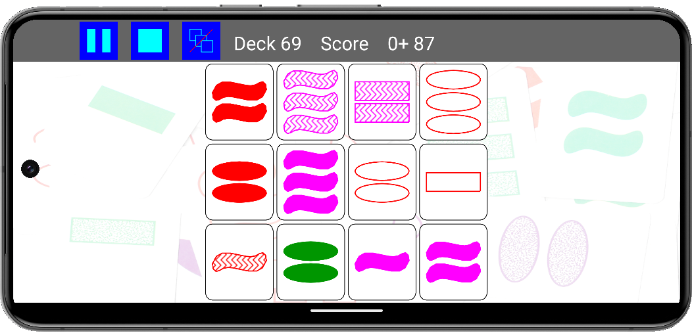

# SuperSet Android
## Introduction
SuperSet is an implementation for Android of the 
[Set game](https://en.wikipedia.org/wiki/Set_(card_game)) originally 
developed by Marsha Falco in 1974 and published by Set Enterprises in 1991.

Set is one of my first serious software implementations dating back to around 2008, where the 
intial C++ implementation was for an ARM based PDA (HP iPAQ hx4700 if I remember well)...

Since the I created versions for PC on Windows and Android.

I used Tatset (author Teun Warnaar) as an example and adopted the same scoring system, 
so scores of Tatset and SuperSet can be compared.

## The SuperSet eco system
The application can be run stand-alone but it also support connection to a SuperSet 
Server (on Linux) that keeps tracks of various users and scores in a MySql Database.
Refer to [my blog page on the software](https://blog.studioblueplanet.net/software/superset), where also binaries can be downloaded for PC.

I intended to add a two player multi-game mode over the internet, but I never finished...

According to todays security standards, the application is poorly implemented, meaning 
that the scoring system can be manipulated easily.